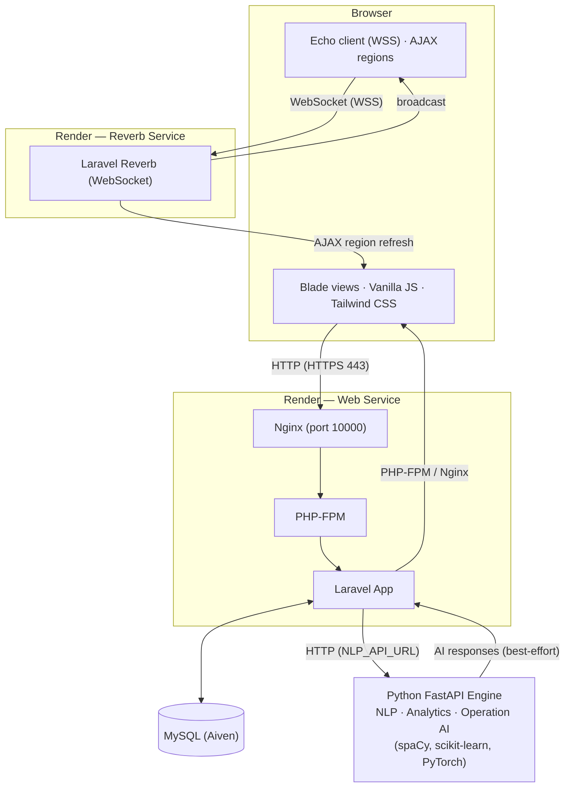

# GCT Systems

Fleet and operations management system for Maintenance, Warehouse, Purchase, Operation, and Administration workflows.

**Production:** [https://gct-systems.onrender.com/](https://gct-systems.onrender.com/)

## Architecture

### Overview

GCT Systems is a **two-engine web application**:

- **Laravel Application** (PHP): the primary web app. Handles authentication, role-based access, all business logic, MySQL persistence, scheduled jobs, and realtime event broadcasting.
- **Python FastAPI Microservice**: an auxiliary ML/NLP engine. Performs PDF extraction and entity recognition, business analytics/forecasting, and ML-powered trip auto-scheduling.

The Laravel app owns the database (MySQL 8.4), the user interface (Blade + Vanilla JS + Tailwind), and the public web/realtime surface. The Python engine is stateless and calling it is best-effort: if it is unreachable, Laravel falls back to deterministic/heuristic logic so core operations keep working.

### Component Diagram



### Request Flow

1. The browser loads the SPA-style Blade pages from the Laravel app over HTTPS (terminated by Render; Nginx listens on port 10000 and forwards PHP to PHP-FPM).
2. Laravel middleware authenticates the user and enforces role-based access (`role` middleware) across the Admin, Maintenance, Purchase, Operation, Warehouse, and Analytics route groups.
3. Controllers interact with Eloquent models and service classes, persist state to **MySQL**, and broadcast realtime events when data changes.
4. For AI features (PDF ingestion, dashboards, auto-scheduling), controllers call the **Python FastAPI engine** over HTTP using `NLP_API_URL`. Responses are degraded gracefully when the engine is unavailable.
5. `RecordSystemActivity` middleware writes to the audit trail for meaningful mutations only (see [Activity Log Policy](#activity-log-policy)).

### Realtime & Live Updates

- Server-side events are broadcast through **Laravel Reverb** (WebSocket server).
- Reverb runs in production as a **separate Render service** using the same Docker image but overriding the start command with `start-reverb.sh` (port 10000 of that service).
- The browser connects over WSS via **Laravel Echo**; received events trigger a refresh of `data-ajax-region` sections instead of a full page reload.

### Background Processing

- A **Supervisor** process inside the production container supervises PHP-FPM, Nginx, and the Laravel scheduler loop (`artisan schedule:run` every 60s).
- Scheduled tasks live in `routes/console.php` (e.g. daily activity-log pruning at 02:30) and ML training pipelines in the Python engine.

### Module Layout

Feature code is organized by business domain in both layers:

| Layer | Admin | Maintenance | Operation | Purchase | Warehouse |
|-------|-------|-------------|-----------|----------|-----------|
| `app/Http/Controllers/` | ✓ | ✓ | ✓ | ✓ | ✓ |
| `app/Models/` | ✓ | ✓ | ✓ | ✓ | ✓ |
| `resources/views/` | ✓ | ✓ | ✓ | ✓ | ✓ |
| `resources/js/` + `css/` | ✓ | ✓ | ✓ | ✓ | ✓ |
| `routes/*.php` | ✓ | ✓ | ✓ | ✓ | ✓ |

Shared UI lives in `resources/views/components/`; cross-cutting services (activity log, dashboard summaries, AI orchestration) live in `app/Services/`.

## Technology Stack

| Layer | Technology |
|-------|------------|
| Backend | Laravel 13, PHP 8.3+ (8.4 in Docker) |
| Database | MySQL 8.4 (SQLite for local dev) |
| Frontend | Blade templates, Vanilla JS, Tailwind CSS 4 |
| Build | Vite 8, laravel-vite-plugin |
| Realtime | Laravel Reverb + Echo (WebSockets) |
| Python Engine | FastAPI, spaCy, scikit-learn, PyTorch |
| Deployment | Docker multi-stage build, Render |
| CI/CD | GitHub Actions |

## Modules

### Maintenance
Job Orders, PMS Scheduling, Mechanic Availability, Fuel Reports, Purchase Requests.

### Warehouse
Inventory Management, Part Requests, Stock Movements, Incoming Deliveries.

### Purchase
Maintenance Requests, Inventory Restock, Purchase Orders, Scheduled Purchases, Purchase History.

### Operation
Routes & Stops, Trip Scheduling, Driver/Bus Assignment, Auto Scheduling (ML-powered), Personnel Management, Driver/Mechanic Attendance, Bus Master List, Trip Records.

### Admin
Account Management, Roles & Permissions, Activity Logs, Notifications, Data Management (batch uploads), Analytics (descriptive/diagnostic dashboards), Settings.

## Prerequisites

- PHP 8.3+
- Composer
- Node.js 22+
- Python 3.10+
- MySQL 8.4 (or SQLite for local dev)

## Local Setup

### Laravel Backend

```bash
composer install
npm install
cp .env.example .env
php artisan key:generate
php artisan migrate
npm run build
php artisan serve
```

Or use the development runner (starts server, queue worker, and Vite concurrently):

```bash
composer run dev
```

### Python Engine

```bash
cd python_engine
pip install -r requirements.txt
uvicorn main:app --reload --host 127.0.0.1 --port 8000
```

Available endpoints:
- `/nlp/extract-pdf` - PDF extraction
- `/analytics/*` - Business analytics
- `/operation/auto-scheduling/ai/*` - ML auto-scheduling
- `/ingestion/*` - Data ingestion

### Docker (Full Stack)

```bash
docker compose up
```

## Project Structure

```
app/
├── Http/Controllers/{Admin,Maintenance,Operation,Purchase,Warehouse}/
├── Models/{Admin,Maintenance,Operation,Purchase,Warehouse}/
├── Services/
├── Events/Listeners/Observers/

python_engine/
├── NLP/            # PDF extraction, NER, severity prediction, anomaly detection
├── analytics/      # Forecasting
├── operation_ai/   # ML-based auto-scheduling

resources/
├── views/{Admin,Maintenance,Operation,Purchase,Warehouse,components}/
├── js/{Admin,Maintenance,Operation,Purchase,Warehouse}/
├── css/{Admin,Maintenance,Operation,Purchase,Warehouse}/

routes/{admin,maintenance,operation,purchase,warehouse}.php

database/migrations/  # 59 migrations
```

## Shared Frontend Architecture

Shared Blade components: `resources/views/components/`

Global styles and JS: `resources/js/app.js`

Page-specific assets: Keep in relevant module folder.

### AJAX Regions

Use `data-ajax-region` attribute and the helper in `resources/js/Main-js/ajax-regions.js` for partial page refreshes.

### Realtime Updates

Events delivered through Laravel Reverb/Echo refresh AJAX-ready regions instead of forcing full page reloads.

## Activity Log Policy

Activity Logs are a controlled audit trail, not click history. The system records meaningful mutations:

- Create, update, delete/deactivate
- Approve/reject, status changes
- Assignments, completions
- Receiving/issuing, imports/uploads
- Account/security changes, permission changes
- Login/logout

**Not logged:** Navigation, searches, filters, pagination, topbar/read-state requests, route calculations, Auto Scheduling previews.

Audit records are retained for 365 days by default and pruned daily:

```env
ACTIVITY_LOG_RETENTION_DAYS=365
ACTIVITY_LOG_PRUNE_BATCH_SIZE=1000
```

Manual pruning:

```bash
php artisan activity-logs:prune
php artisan activity-logs:prune --days=180
```

## Testing

### Pest PHP

```bash
php artisan test
# or
composer run test
```

Test suites: Feature (8 tests) + Unit (1 test)

### Python ML Tests

```bash
cd python_engine
python operation_ai/test_ml.py
```

## Development Workflow

### Code Style

- **PHP:** Laravel Pint
- **General:** `.editorconfig`

### Conventions

- Reuse shared Blade/UI components instead of duplicating UI
- Keep Personnel Management separate from daily Attendance
- Keep page-specific CSS/JS in the relevant module folder
- Use JavaScript for dynamic behavior, not hiding obsolete markup

## Deployment

Docker multi-stage build:

1. **Build stage:** Node 22 + npm (Vite assets)
2. **Runtime stage:** PHP 8.4-FPM + Nginx + Supervisor

Exposed port: 10000

### Environment Variables (Build-time)

- `VITE_REVERB_APP_KEY`
- `VITE_REVERB_HOST`
- `VITE_REVERB_PORT`
- `VITE_REVERB_SCHEME`

## Known Limitations

- Department/role restrictive middleware is intentionally deferred during testing

## License

MIT